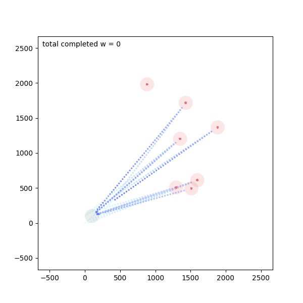

# Multi-UAV-Task-Assignment-MARL
A decentralized multi-UAV task allocation framework using Multi-Agent Deep Reinforcement Learning (MARL) implemented in PyTorch.

This project formulates cooperative UAV task assignment as a constrained multi-agent Markov Decision Process (MDP), where multiple UAVs coordinate to complete rescue tasks under payload and coverage constraints.

## 📌 Problem Description

In rescue missions, each UAV must select a task to execute while:

- Each UAV can execute **only one task**
- Each task must be assigned to **at least one UAV**
- UAV payload capacity is limited
- Cooperation is allowed when tasks require more workload than a single UAV can handle

The objective is to **maximize total completed workload** across all UAVs.

---

## 🧠 Methodology

We model the system as a **multi-agent MDP**, where:

- **Agents:** UAVs  
- **State:** UAV payload capacity, task demand, assignment status  
- **Action:** Task selection for each UAV  
- **Reward:** Total completed workload  

A **Multi-Agent Deep Reinforcement Learning (MARL)** framework is implemented using PyTorch.

Possible algorithms:
- MADDPG / MAPPO / Independent PPO (depending on implementation)
- Centralized training with decentralized execution

---

## 📊 Results

The MARL-based approach achieves:

- Efficient decentralized coordination
- Improved total completed workload compared to greedy/random baselines
- Stable convergence behavior during training

### Average reward


### Task assignment


[Download Demo Video](https://github.com/thuyminh2112/Multi-UAV-Task-Assignment-MARL/blob/main/animated_plot_1.mp4)

---
## Environment
```python
pip install -r requirements.txt
```
## Run the model
```python
python main.py
```


## 🛠 Tech Stack

- Python 3.x
- PyTorch
- NumPy
- OpenAI Gym-style custom environment

---
